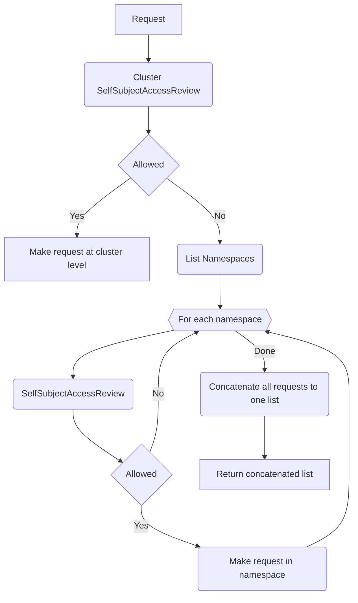
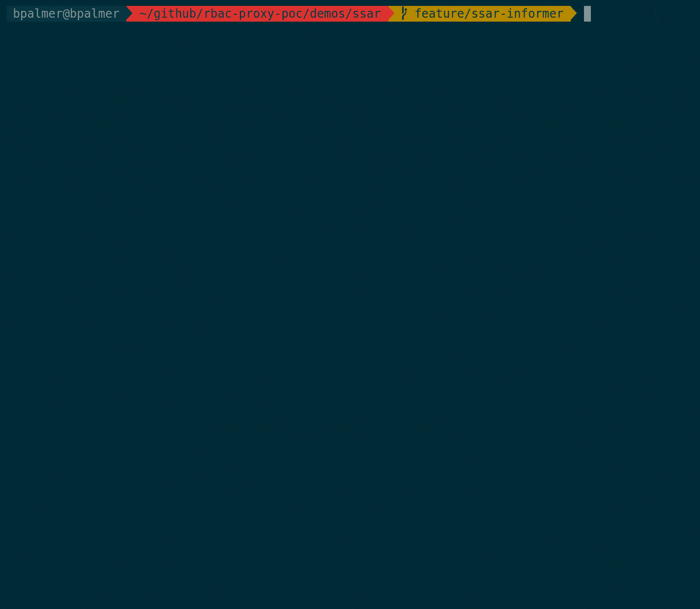

# SelfSubjectAccessReview Demo
This demo is to show an implementation of the [client-go](https://github.com/kubernetes/client-go) `ListerWatcher` interface
that utilizes the Kubernetes `SelfSubjectAccessReview` resource to filter `List` and `Watch` requests.

## How it Works
For a given `List`/`Watch` request the flow is as follows:


## Demo Steps
This demonstration will show how the 
1. Create a cluster by running:
```
kind create cluster
```

2. Create the `ssar-demo` `ServiceAccount` by running:
```
kubectl apply -f service_account.yaml
```

In this step we are creating the `ServiceAccount` that our pod running the simple program using `SelfSubjectAccessReview` for scoping will use
to list and watch `Pod` resources. This `ServiceAccount` will allow us to scope down the permissions using RBAC.

3. Create the RBAC for the `ServiceAccount` by running:
```
kubectl apply -f rbac.yaml
```

In this step we are creating ClusterRoles and binding them to the `ServiceAccount` created in step 2 to do the following:
- Allow the `ServiceAccount` permissions to get, list, and watch `pods` in the `default` namespace
- Allow the `ServiceAccount` permissions to list `namespaces` in the cluster (required permission when using this method of scoping)
- Allow the `ServiceAccount` all permissions for `selfsubjectaccessreviews` in the cluster (required permission when using this method of scoping) (might be able to scope this down)

4. Create the `ssar-demo-pod` by running:
```
kubectl apply -f ssar_demo.yaml
```

This step will run a pod that runs a simple program for listing and watching pods. The returned list and watch values should be filtered by the `ScopedListerWatcher`.

5. Check the logs of the `ssar-demo-pod` by running:
```
kubectl logs ssar-demo-pod
```

This step show the log output of the pod created in step 4 to show how the pods are filtered. The logs should look similar to
```
RBAC Proxy!
Getting Pods!
Got some Pods!
Got Pod -->  ssar-demo-pod
-----------------------------------
Watching Pods!
ADDED - `ssar-demo-pod` in namespace `default`
MODIFIED - `ssar-demo-pod` in namespace `default`
```

6. Test the watches by creating a new pod in the `default` namespace and a new pod in the `kube-system` namespace
```
kubectl apply -f watch.yaml
```

This step shows how the `ScopedListerWatcher` properly scopes watch request by:
- Creating a pod in the `default` namespace which should show up in the logs of the `ssar-demo-pod`
- Creating a pod in the `kube-system` namespace which should NOT show up in the logs of the `ssar-demo-pod`

7. Check the logs of the `ssar-demo-pod` again by running:
```
kubectl logs ssar-demo-pod
```

In the logs we should only see the pod `ssar-allowed-watch` show up. The logs should look similar to:
```
RBAC Proxy!
Getting Pods!
Got some Pods!
Got Pod -->  ssar-demo-pod
-----------------------------------
Watching Pods!
ADDED - `ssar-demo-pod` in namespace `default`
MODIFIED - `ssar-demo-pod` in namespace `default`
ADDED - `ssar-allowed-watch` in namespace `default`
MODIFIED - `ssar-allowed-watch` in namespace `default`
MODIFIED - `ssar-allowed-watch` in namespace `default`
```

## Demo GIF
